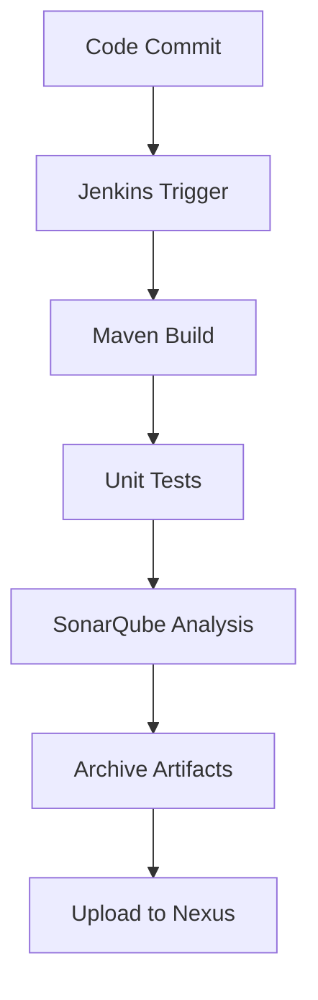

# Jenkins CI Pipeline for Java Web App (vProfile)

Welcome to the future of clean code and continuous delivery.

This project sets up a robust **Continuous Integration** pipeline using **Jenkins**, with support from **SonarQube**, **Nexus**, **Maven**, and **GitHub**. The pipeline automatically builds, tests, performs static analysis, versions artifacts, and pushes verified `.war` files to a Nexus repository.

---

## Architecture Overview

Why this Project?
In large, fast-paced dev teams, pushing code isn’t the hard part — ensuring it doesn’t break everything else is. CI solves that.

- Catch bugs early

- Shorten feedback loops

- Automate the boring stuff

- Be DevOps-ready

## Tools Used
Tool	Purpose
Jenkins	CI server for automation
Maven	Dependency management & builds
SonarQube	Static code analysis
Nexus	Artifact repository
GitHub	Source control
Ubuntu	Jenkins host OS (via AWS EC2)

## Setup Summary

### Jenkins (on AWS EC2)
- **Instance**: t2.small
- **Port**: 8080
- **Installed**: OpenJDK 21, Jenkins
- **Plugins**:
  - Git Plugin
  - Pipeline Maven Integration
  - SonarQube Scanner
  - Nexus Artifact Uploader
  - Build Timestamp Plugin

### Nexus (on separate EC2)
- **Instance**: t2.medium
- **Port**: 8081
- **Configured as**: Maven repository (for deployment)

### SonarQube (on separate EC2)
- **Stack**: SonarQube + PostgreSQL + Nginx
- **Port**: 80
- **Integrated with**: Jenkins for quality gates

## Pipeline Flow
## CI/CD Process Flow

### Code Push
- **Action**: Developer pushes code to GitHub branch

### Jenkins Trigger
- **Action**: Jenkins pulls the latest code from GitHub

### Build Stage
- **Action**: Maven compiles and packages the project into a `.war` file

### Unit Test
- **Action**: JUnit tests are executed; results are saved as XML

### Code Analysis
- **Action**: SonarQube performs static code analysis to detect code smells and bugs

### Artifact Versioning
- **Action**: `.war` file is archived with a timestamp and semantic versioning

### Upload to Nexus
- **Action**: Clean, verified `.war` file is pushed to the Nexus repository

## Parameterized Builds
- Jenkins job marked as parameterized

- Accepts VERSION (string input)

- Build version tagged as v$VERSION.war and uploaded

## SonarQube Reporting
- Quality Gates enforced

- Checkstyle results uploaded

- Fails the build if major issues are found

## Access Points
Service	URL (example)
Jenkins	http://jenkins.harshitch.xyz:8080
Nexus	http://<nexus-ec2-public-ip>:8081
SonarQube	http://<sonarqube-ec2-public-ip>/

## Final Notes
EC2 instances should ideally use Elastic IPs or be behind Route53 DNS to avoid losing access on reboot.

Nexus and SonarQube require more memory — t2.medium or higher is recommended.

Use nginx as a reverse proxy for SSL and domain-based routing.
Application accessible via Nginx IP once provisioning completes.

Full project Write-up [here](https://www.notion.so/End-to-End-CI-Pipeline-with-Jenkins-Nexus-and-SonarQube-1f07d8e8dcad80d1bc20e2636ff74494?pvs=4)

Check out the original code [here](https://github.com/hkhcoder/vprofile-project/tree/atom)
